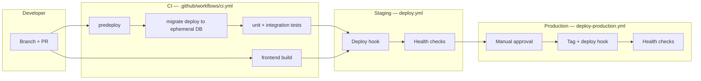

# CI/CD pipeline blueprint (Phase 6.5)

This document is the **operational contract** for how code and database migrations move from a developer machine to **staging** and **production**. It ties together GitHub Actions, host deploy hooks (e.g. Render), and the guarded scripts in `backend/package.json`.

## Goals

| Goal | Mechanism |
|------|-----------|
| No unverified migrations in production | CI applies migrations to an **ephemeral** Postgres and runs tests; staging runs **`npm run start:prod`** (or equivalent) against a **non-prod** DB before production. |
| Same validation gate everywhere | **`npm run predeploy`** in CI matches the first step of **`npm run start:prod`**. |
| Staging before production | **Deploy Staging** runs after **green CI** on `main`; **Deploy Production** is **manual** (`workflow_dispatch`) with GitHub **Environment** protection. |
| Reduce panic deploys | Production deploy creates a **release tag**; optional **rollback** job redeploys a known image via hook (app rollback — not DB rollback). |

## End-to-end flow

**Narrative:**

1. **Pull request** → **CI** runs (backend: `ci-env-guard`, `predeploy`, guarded `migrate deploy`, tests; frontend: `npm run build`).
2. **Merge to `main`** → CI runs again on `main`.
3. **CI/CD Pipeline** (`deploy.yml`) triggers when **CI** completes **successfully** on `main` (or manually via `workflow_dispatch`). It calls your **staging deploy hook** (e.g. Render), then polls **public health URLs** until they pass.
4. **Deploy Production** is **only** `workflow_dispatch` (or optional scheduled release). It requires the **`production`** GitHub Environment (configure **required reviewers**). It **verifies** (same commit): a **successful `CI` workflow run** and an **allowed git tag** on that commit (e.g. `v1.0-rc.0`, semver, or dated `vYYYY.MM.DD-*`). Tag the commit **before** running the workflow; the deploy hook receives that tag name. Then it POSTs to **production deploy hook** and hits production health URLs.

**Human rule:** Do not run **Deploy Production** until staging is verified for that same commit lineage (same merge or same artifact you intend to ship).

## Workflow files (repo map)

| File | Trigger | Role |
|------|---------|------|
| `.github/workflows/ci.yml` | `push` / `pull_request` to `main`, `master`, `develop` | **Validation gate:** schema (`predeploy`), migrations against ephemeral Postgres, tests, frontend build. |
| `.github/workflows/deploy.yml` | `workflow_run` after successful **CI** on `main`, or `workflow_dispatch` | **Staging promotion:** trigger host deploy + smoke health checks (`name: CI/CD Pipeline`). |
| `.github/workflows/deploy-production.yml` | `workflow_dispatch` only | **Production promotion:** **CI + tag gates** on the commit, then hook + health; separate **rollback** path via hook (no CI/tag gates). |

### Why `deploy.yml` does not include CI or production `migrate deploy`

- **CI** stays in **`ci.yml`** so every PR and branch gets the same jobs without duplicating work when `main` is pushed.
- **Production database** changes are applied **on the host** via **`npm run start:prod`** (predeploy → migrate deploy → server). Running `prisma migrate deploy` from GitHub Actions against production would require storing **`DATABASE_URL`** in Actions secrets and duplicate the host entrypoint — avoid unless your org mandates it.
- **Production deploy** stays **`workflow_dispatch`**-only (`deploy-production.yml`) so **every merge to `main` does not** open a pending production approval; you promote when ready.

## Environment variables & tiers

| Context | `NODE_ENV` | `MIGRATION_ENV` | Notes |
|---------|------------|-----------------|--------|
| CI backend job | `test` | `staging` | Matches **staging-tier** policy in `prisma-env-policy.js` for `migrate deploy`. |
| Staging host | `staging` or `production` (platform default) | Set **`staging`** explicitly if you use `migrate deploy` via scripts | Prefer **`MIGRATION_ENV=staging`** on the staging service so policy matches intent. |
| Production host | `production` | `production` (or unset; tier inferred from `NODE_ENV`) | **`npm run start:prod`** runs predeploy → guarded migrate → server. |

See **`DEPLOYMENT_ENVIRONMENT_RULES.md`**, **`STAGING_DEPLOYMENT_RULES.md`**, and **`prisma-env-policy.js`**.

## GitHub configuration checklist

### Secrets (repository or environment-scoped)

**Staging workflow**

| Secret | Used by |
|--------|---------|
| `STAGING_DEPLOY_HOOK_URL` | POST to trigger deploy (e.g. Render **Deploy Hook**). |
| `STAGING_API_HEALTH_URL` | Full URL to `GET /health` (or your canonical liveness URL). |
| `STAGING_SYSTEM_HEALTH_URL` | Full URL to `GET /system/health` if you rely on it for smoke tests. |

**Production workflow**

| Secret | Used by |
|--------|---------|
| `PRODUCTION_DEPLOY_HOOK_URL` | POST to trigger production deploy (your platform should run **`npm run start:prod`** or Docker entrypoint equivalent). |
| `PRODUCTION_API_HEALTH_URL` | Production `GET /health`. |
| `PRODUCTION_SYSTEM_HEALTH_URL` | Production `GET /system/health`. |
| `PRODUCTION_ROLLBACK_HOOK_URL` | POST for rollback job (redeploy previous image / release). |

### Environments

1. Create **`staging`** and **`production`** in **Settings → Environments**.
2. Attach secrets to the right environment when possible (least exposure).
3. On **`production`**, enable **Required reviewers** (1–2 people) so **Deploy Production** cannot run without approval.

### Branch protection (`main`)

Recommended:

- Require **status checks** (CI workflow) before merge.
- Require pull request reviews.

## Host (e.g. Render) expectations

- **Build:** `npm ci` in repo root (frontend) and/or `backend` as you have structured; `prisma generate` is typically part of install or build.
- **Start command (backend service):** from `backend` directory, **`npm run start:prod`** so **predeploy → migrate deploy → server** always runs in order.
- **Do not** set `CI=true` on production runtime — that would confuse migration policy if mis-set.
- **Database:** production `DATABASE_URL` only from secret store; never from git.

Docker (if you add it later): run the same command sequence in `ENTRYPOINT` / `CMD`; keep **one** process that runs migrations then Node.

## Optional hardening: drift detection

If you use a shadow database (`SHADOW_DATABASE_URL`), you can extend CI with `prisma migrate diff` or the repo scripts **`npm run prisma:drift-check`** / **`prisma:drift-check:win`** to compare migrations to the live schema **before** relying on deploy hooks. Add a CI step only after `SHADOW_DATABASE_URL` is available in that job’s environment.

## What this pipeline does *not* automate

| Gap | Mitigation |
|-----|------------|
| “Staging passed” is not a hard **GitHub `needs:`** dependency for production | **Process:** only promote after you have confirmed staging for the artifact you are shipping. Optional future: `workflow_call` from staging → production. |
| Malicious migration SQL | **Code review** + **`MIGRATION_COMPATIBILITY.md`** + CI apply smoke test. |
| Zero-downtime for heavy migrations | **Expand/contract** migrations + maintenance windows for rare breaking changes. |

## Rollback

- **Application:** use **Deploy Production → rollback** with `PRODUCTION_ROLLBACK_HOOK_URL`, or redeploy a previous image in the host UI. Align with **`HOTFIX_PLAYBOOK.md`** (DB rolls **forward**, not backward).
- **Database:** do not “revert” migrations casually; ship a **forward** migration if repair is needed.

## Related docs

- `HOTFIX_PLAYBOOK.md` — production fixes without panic.
- `MIGRATION_COMPATIBILITY.md` — additive-first schema changes.
- `STAGING_DEPLOYMENT_RULES.md` — role of staging.
- `DEPLOYMENT_ENVIRONMENT_RULES.md` — env vars and Prisma commands.
